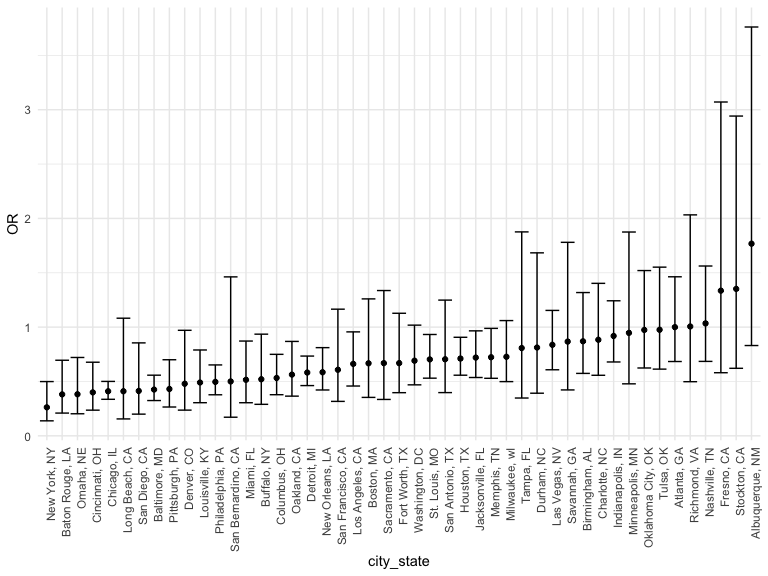
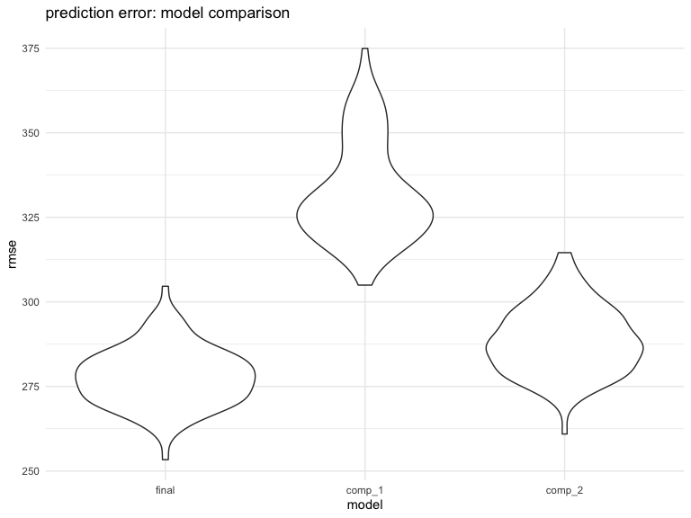

Homework 6
================
Bin Yang
11/24/2020

### Problem 1

    homicide_df = 
      read_csv("data/homicide-data.csv", na = c("", "NA", "Unknown")) %>% 
      mutate(
        city_state = str_c(city, state, sep = ", "),
        victim_age = as.numeric(victim_age),
        resolution = case_when(
          disposition == "Closed without arrest" ~ 0,
          disposition == "Open/No arrest"        ~ 0,
          disposition == "Closed by arrest"      ~ 1)
      ) %>% 
      filter(
        victim_race %in% c("White", "Black"),
        city_state != "Tulsa, AL") %>% 
      select(city_state, resolution, victim_age, victim_race, victim_sex)

    ## Parsed with column specification:
    ## cols(
    ##   uid = col_character(),
    ##   reported_date = col_double(),
    ##   victim_last = col_character(),
    ##   victim_first = col_character(),
    ##   victim_race = col_character(),
    ##   victim_age = col_double(),
    ##   victim_sex = col_character(),
    ##   city = col_character(),
    ##   state = col_character(),
    ##   lat = col_double(),
    ##   lon = col_double(),
    ##   disposition = col_character()
    ## )

Start with one city.

    baltimore_df =
      homicide_df %>% 
      filter(city_state == "Baltimore, MD")
    glm(resolution ~ victim_age + victim_race + victim_sex, 
        data = baltimore_df,
        family = binomial()) %>% 
      broom::tidy() %>% 
      mutate(
        OR = exp(estimate),
        CI_lower = exp(estimate - 1.96 * std.error),
        CI_upper = exp(estimate + 1.96 * std.error)
      ) %>% 
      select(term, OR, starts_with("CI")) %>% 
      knitr::kable(digits = 3)

| term              |    OR | CI\_lower | CI\_upper |
|:------------------|------:|----------:|----------:|
| (Intercept)       | 1.363 |     0.975 |     1.907 |
| victim\_age       | 0.993 |     0.987 |     1.000 |
| victim\_raceWhite | 2.320 |     1.648 |     3.268 |
| victim\_sexMale   | 0.426 |     0.325 |     0.558 |

Try this across cities.

    models_results_df = 
      homicide_df %>% 
      nest(data = -city_state) %>% 
      mutate(
        models = 
          map(.x = data, ~glm(resolution ~ victim_age + victim_race + victim_sex, data = .x, family = binomial())),
        results = map(models, broom::tidy)
      ) %>% 
      select(city_state, results) %>% 
      unnest(results) %>% 
      mutate(
        OR = exp(estimate),
        CI_lower = exp(estimate - 1.96 * std.error),
        CI_upper = exp(estimate + 1.96 * std.error)
      ) %>% 
      select(city_state, term, OR, starts_with("CI")) 

    models_results_df %>% 
      filter(term == "victim_sexMale") %>% 
      mutate(city_state = fct_reorder(city_state, OR)) %>% 
      ggplot(aes(x = city_state, y = OR)) + 
      geom_point() + 
      geom_errorbar(aes(ymin = CI_lower, ymax = CI_upper)) + 
      theme(axis.text.x = element_text(angle = 90, hjust = 1))

### Problem 2

-   Load and clean the data for regression analysis (i.e. convert
    numeric to factor where appropriate, check for missing data, etc.).

<!-- -->

    baby_df = read_csv("./data/birthweight.csv")

    ## Parsed with column specification:
    ## cols(
    ##   .default = col_double()
    ## )

    ## See spec(...) for full column specifications.

    baby_lm = baby_df %>% 
      mutate(
        babysex = as.factor(babysex), 
        frace = as.factor(frace),
        malform = as.factor(malform),
        mrace = as.factor(mrace)
      )

    sapply(baby_lm, function(x) sum(is.na(x))) %>% 
      knitr::kable(caption = "table for missing values", 
                   col.names = c("missing value count"))

|          | missing value count |
|:---------|--------------------:|
| babysex  |                   0 |
| bhead    |                   0 |
| blength  |                   0 |
| bwt      |                   0 |
| delwt    |                   0 |
| fincome  |                   0 |
| frace    |                   0 |
| gaweeks  |                   0 |
| malform  |                   0 |
| menarche |                   0 |
| mheight  |                   0 |
| momage   |                   0 |
| mrace    |                   0 |
| parity   |                   0 |
| pnumlbw  |                   0 |
| pnumsga  |                   0 |
| ppbmi    |                   0 |
| ppwt     |                   0 |
| smoken   |                   0 |
| wtgain   |                   0 |

table for missing values

I converted babysex, frace, malform and mrace to factor. There’s no
missing values in the dataset.

-   Propose a regression model for birthweight.

I first created correlation plot for all continuous variables:

    cor_df = 
      baby_df %>% 
      select(-babysex, -frace, -malform, -mrace) %>% 
      select(bwt, everything())

    mcor = round(cor(cor_df), 2)

    upper<- mcor

    upper[upper.tri(mcor)]<- ""

    upper<- as.data.frame(upper)

    upper %>% 
      arrange(desc(bwt)) %>% 
      knitr::kable(caption = "correlation matrxi for continuous variables")

|          | bwt   | bhead | blength | delwt | fincome | gaweeks | menarche | mheight | momage | parity | pnumlbw | pnumsga | ppbmi | ppwt  | smoken | wtgain |
|:---------|:------|:------|:--------|:------|:--------|:--------|:---------|:--------|:-------|:-------|:--------|:--------|:------|:------|:-------|:-------|
| bwt      | 1     |       |         |       |         |         |          |         |        |        |         |         |       |       |        |        |
| bhead    | 0.75  | 1     |         |       |         |         |          |         |        |        |         |         |       |       |        |        |
| blength  | 0.74  | 0.63  | 1       |       |         |         |          |         |        |        |         |         |       |       |        |        |
| gaweeks  | 0.41  | 0.38  | 0.36    | 0.12  | 0.11    | 1       |          |         |        |        |         |         |       |       |        |        |
| delwt    | 0.29  | 0.21  | 0.23    | 1     |         |         |          |         |        |        |         |         |       |       |        |        |
| wtgain   | 0.25  | 0.18  | 0.19    | 0.42  | -0.02   | 0.15    | -0.04    | 0.05    | -0.09  | 0.01   | NA      | NA      | -0.11 | -0.07 | 0.03   | 1      |
| mheight  | 0.19  | 0.12  | 0.16    | 0.41  | 0.13    | 0.06    | 0.07     | 1       |        |        |         |         |       |       |        |        |
| ppwt     | 0.18  | 0.14  | 0.15    | 0.87  | 0.05    | 0.06    | -0.07    | 0.43    | 0.13   | -0.01  | NA      | NA      | 0.85  | 1     |        |        |
| fincome  | 0.15  | 0.12  | 0.08    | 0.03  | 1       |         |          |         |        |        |         |         |       |       |        |        |
| momage   | 0.14  | 0.11  | 0.08    | 0.07  | 0.32    | 0.11    | 0.18     | 0.11    | 1      |        |         |         |       |       |        |        |
| ppbmi    | 0.09  | 0.09  | 0.07    | 0.72  | -0.02   | 0.03    | -0.12    | -0.1    | 0.08   | -0.01  | NA      | NA      | 1     |       |        |        |
| smoken   | -0.08 | -0.05 | -0.07   | 0.05  | 0.08    | 0.04    | 0.02     | 0.06    | 0.08   | -0.01  | NA      | NA      | 0.01  | 0.04  | 1      |        |
| menarche | -0.02 | 0     | -0.02   | -0.09 | 0       | 0       | 1        |         |        |        |         |         |       |       |        |        |
| parity   | -0.01 | -0.02 | -0.03   | 0     | -0.03   | -0.08   | 0.02     | -0.01   | 0.05   | 1      |         |         |       |       |        |        |
| pnumlbw  | NA    | NA    | NA      | NA    | NA      | NA      | NA       | NA      | NA     | NA     | 1       |         |       |       |        |        |
| pnumsga  | NA    | NA    | NA      | NA    | NA      | NA      | NA       | NA      | NA     | NA     | NA      | 1       |       |       |        |        |

correlation matrxi for continuous variables

I will choose the top 5 variables that have the largest correlation with
birth weight, include all categorical variables as well as their
interaction terms.

    lm_proposed = lm(bwt ~ bhead + blength + gaweeks + delwt + wtgain + 
                       babysex + frace + malform + mrace, data = baby_lm)

Then I will use stepwise selection to find the best model:

    stats::step(lm_proposed, direction = 'both')

    ## Start:  AIC=48796.64
    ## bwt ~ bhead + blength + gaweeks + delwt + wtgain + babysex + 
    ##     frace + malform + mrace
    ## 
    ##           Df Sum of Sq       RSS   AIC
    ## - frace    4    101709 327755652 48790
    ## - malform  1      1293 327655237 48795
    ## <none>                 327653943 48797
    ## - mrace    3    772409 328426352 48801
    ## - babysex  1   1149774 328803718 48810
    ## - wtgain   1   2289896 329943840 48825
    ## - gaweeks  1   4070650 331724594 48848
    ## - delwt    1   4678861 332332804 48856
    ## - blength  1 108348610 436002553 50035
    ## - bhead    1 111271727 438925670 50064
    ## 
    ## Step:  AIC=48789.99
    ## bwt ~ bhead + blength + gaweeks + delwt + wtgain + babysex + 
    ##     malform + mrace
    ## 
    ##           Df Sum of Sq       RSS   AIC
    ## - malform  1      1246 327756898 48788
    ## <none>                 327755652 48790
    ## + frace    4    101709 327653943 48797
    ## - babysex  1   1146395 328902047 48803
    ## - wtgain   1   2290149 330045801 48818
    ## - gaweeks  1   4079898 331835550 48842
    ## - delwt    1   4704454 332460106 48850
    ## - mrace    3  15946287 343701939 48990
    ## - blength  1 108343253 436098905 50028
    ## - bhead    1 111334540 439090192 50058
    ## 
    ## Step:  AIC=48788.01
    ## bwt ~ bhead + blength + gaweeks + delwt + wtgain + babysex + 
    ##     mrace
    ## 
    ##           Df Sum of Sq       RSS   AIC
    ## <none>                 327756898 48788
    ## + malform  1      1246 327755652 48790
    ## + frace    4    101661 327655237 48795
    ## - babysex  1   1147990 328904887 48801
    ## - wtgain   1   2289016 330045914 48816
    ## - gaweeks  1   4081393 331838291 48840
    ## - delwt    1   4704357 332461255 48848
    ## - mrace    3  15952242 343709139 48988
    ## - blength  1 108393422 436150320 50027
    ## - bhead    1 111333676 439090574 50056

    ## 
    ## Call:
    ## lm(formula = bwt ~ bhead + blength + gaweeks + delwt + wtgain + 
    ##     babysex + mrace, data = baby_lm)
    ## 
    ## Coefficients:
    ## (Intercept)        bhead      blength      gaweeks        delwt       wtgain  
    ##   -5854.102      133.106       76.653       10.795        1.684        2.341  
    ##    babysex2       mrace2       mrace3       mrace4  
    ##      33.196     -127.678      -56.509     -107.195

And my final proposed model is:

    lm_final = lm(formula = bwt ~ bhead + blength + gaweeks + delwt + wtgain + 
        babysex + mrace, data = baby_lm) 

    summary(lm_final)

    ## 
    ## Call:
    ## lm(formula = bwt ~ bhead + blength + gaweeks + delwt + wtgain + 
    ##     babysex + mrace, data = baby_lm)
    ## 
    ## Residuals:
    ##     Min      1Q  Median      3Q     Max 
    ## -1067.9  -184.4    -4.5   179.3  2419.6 
    ## 
    ## Coefficients:
    ##               Estimate Std. Error t value Pr(>|t|)    
    ## (Intercept) -5854.1015    99.1966 -59.015  < 2e-16 ***
    ## bhead         133.1056     3.4699  38.360  < 2e-16 ***
    ## blength        76.6527     2.0252  37.850  < 2e-16 ***
    ## gaweeks        10.7952     1.4698   7.345 2.45e-13 ***
    ## delwt           1.6838     0.2135   7.885 3.94e-15 ***
    ## wtgain          2.3410     0.4256   5.500 4.01e-08 ***
    ## babysex2       33.1963     8.5222   3.895 9.96e-05 ***
    ## mrace2       -127.6778     8.9412 -14.280  < 2e-16 ***
    ## mrace3        -56.5086    42.6025  -1.326    0.185    
    ## mrace4       -107.1952    18.7653  -5.712 1.19e-08 ***
    ## ---
    ## Signif. codes:  0 '***' 0.001 '**' 0.01 '*' 0.05 '.' 0.1 ' ' 1
    ## 
    ## Residual standard error: 275.1 on 4332 degrees of freedom
    ## Multiple R-squared:  0.7122, Adjusted R-squared:  0.7116 
    ## F-statistic:  1191 on 9 and 4332 DF,  p-value: < 2.2e-16

-   Show a plot of model residuals against fitted values

<!-- -->

    baby_lm %>% 
    add_residuals(lm_final) %>% 
    add_predictions(lm_final) %>% 
      ggplot(aes(x = pred, y = resid)) + 
      geom_point() + 
      geom_line(y = 0, color = "red") + 
      labs(
        title = "residual vs fitted value plot",
        x = "fitted value(gram)",
        y = "residuals"
      )

-   Compare your model to two others:

<!-- -->

    cv_df = crossv_mc(baby_df, 100)

    cv_df = 
      cv_df %>% 
      mutate(
        train = map(train, as_tibble),
        test = map(test, as_tibble))

    cv_df = 
      cv_df %>% 
      mutate(
        lm_final = map(train, ~lm(bwt ~ bhead + blength + gaweeks + delwt + wtgain + 
        babysex + mrace, data = .x)),
        lm_comp_1 = map(train, ~lm(bwt ~ blength + gaweeks, data = .x)),
        lm_comp_2 = map(train, ~lm(bwt ~ bhead * blength * babysex, data = .x))
        ) %>% 
      mutate(
        rmse_final = map2_dbl(lm_final, test, ~rmse(model = .x, data = .y)),
        rmse_comp_1 = map2_dbl(lm_comp_1, test, ~rmse(model = .x, data = .y)),
        rmse_comp_2 = map2_dbl(lm_comp_2, test, ~rmse(model = .x, data = .y))
      )

    cv_df %>% 
      select(starts_with("rmse")) %>% 
    pivot_longer(
        everything(),
        names_to = "model", 
        values_to = "rmse",
        names_prefix = "rmse_") %>% 
      mutate(model = fct_inorder(model)) %>% 
      ggplot(aes(x = model, y = rmse)) + geom_violin() + 
      labs(
        title = "prediction error: model comparison"
      )

We can see that the proposed final model has the lowest RMSE and is
therefore the best performing model.

### Problem 3

    weather_df = 
      rnoaa::meteo_pull_monitors(
        c("USW00094728"),
        var = c("PRCP", "TMIN", "TMAX"), 
        date_min = "2017-01-01",
        date_max = "2017-12-31") %>%
      mutate(
        name = recode(id, USW00094728 = "CentralPark_NY"),
        tmin = tmin / 10,
        tmax = tmax / 10) %>%
      select(name, id, everything())

    ## Registered S3 method overwritten by 'hoardr':
    ##   method           from
    ##   print.cache_info httr

    ## using cached file: /Users/byang/Library/Caches/R/noaa_ghcnd/USW00094728.dly

    ## date created (size, mb): 2020-10-05 15:42:45 (7.522)

    ## file min/max dates: 1869-01-01 / 2020-10-31
